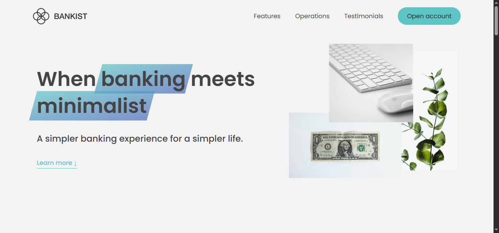
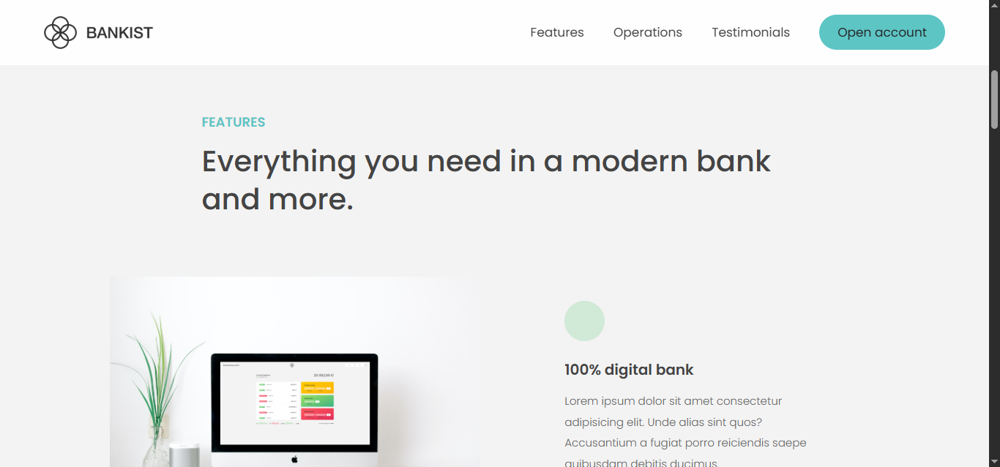
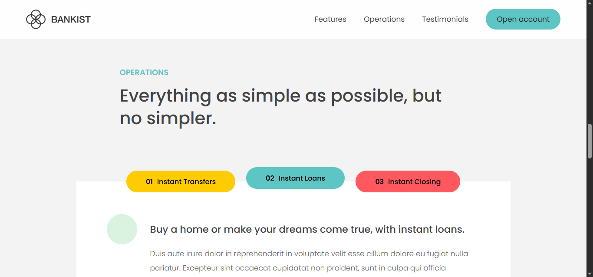
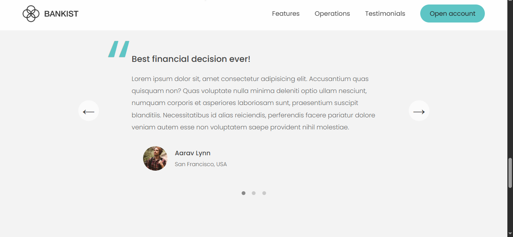
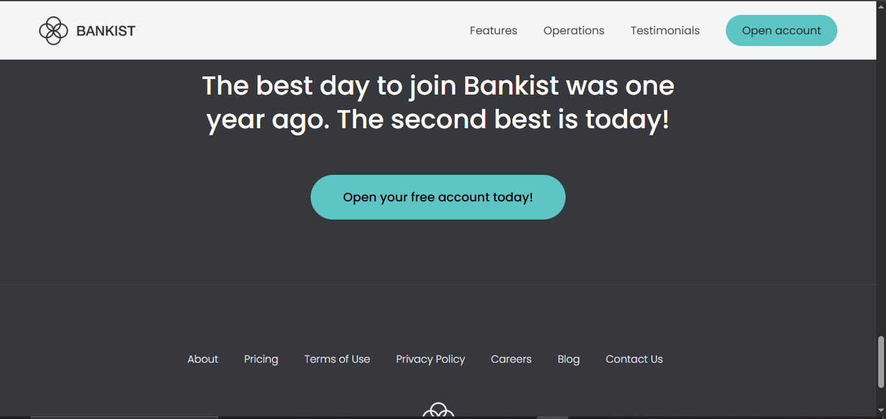
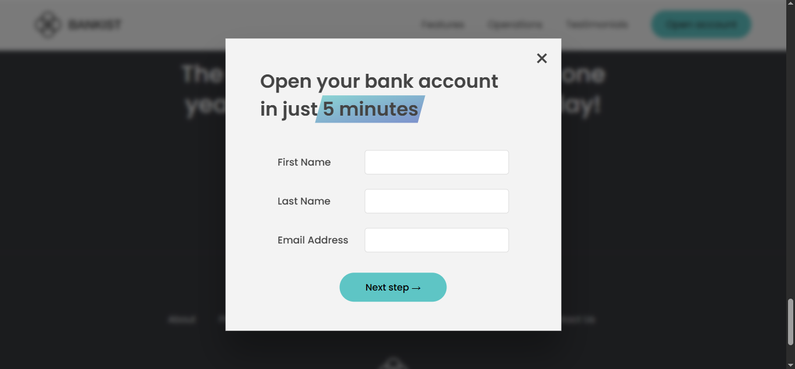

# 💼 Bankit Marketing Website
A **responsive single-page marketing website** built using **HTML, CSS, and JavaScript** with interactive UI and DOM manipulation effects.

This website demonstrates a professional landing page for a fictional bank — "Bankit" — including:
- Scroll-triggered animations
- Blur removal on scroll
- Modals and interactive buttons
- Testimonial slider

> 🎓 This project was built by following Jonas Schmedtmann’s JavaScript course on [jonas.io](https://jonas.io).
## ✨ Features

- **Smooth Scrolling** – single-page navigation with animated scroll
- **Scroll Animation** – sections fade in with blur effect that is removed as you scroll
- **Interactive Modal** – popup form appears on button click (login, open account, etc.)
- **Dynamic Info Sections** – different content shown depending on clicked button
- **Testimonial Slider** – swipe through client reviews

## 🖼️ Screenshots

### 🔹 Hero Section

### 🔹 Features Section

### 🔹 Operation Section

### 🔹 Testimonials Slider

### 🔹 Footer Section

### 🔹 Modal Form

## 🚀 How to Run the Project

- Clone or download the repository
- Open index.html in any modern web browser.   ## 🛠️ Technologies Used

- 🧱 HTML5
- 🎨 CSS3
- ⚙️ JavaScript
